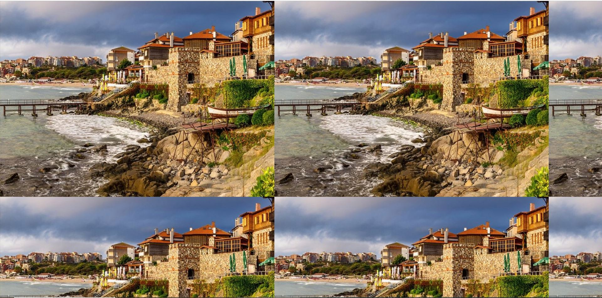
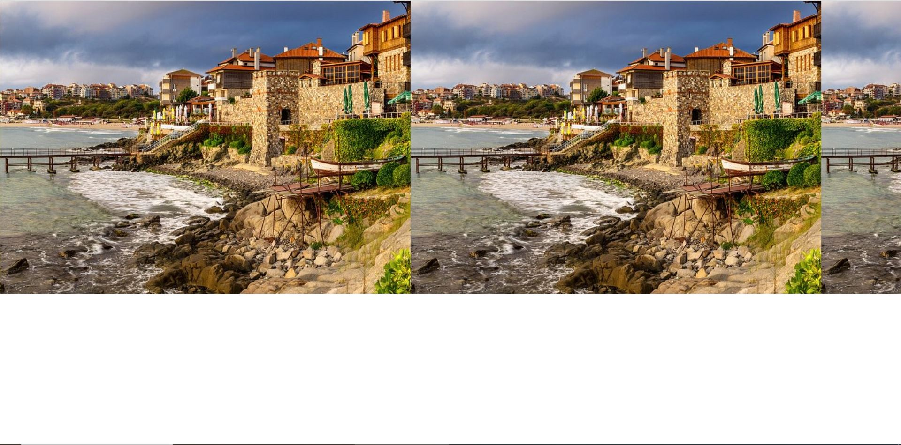
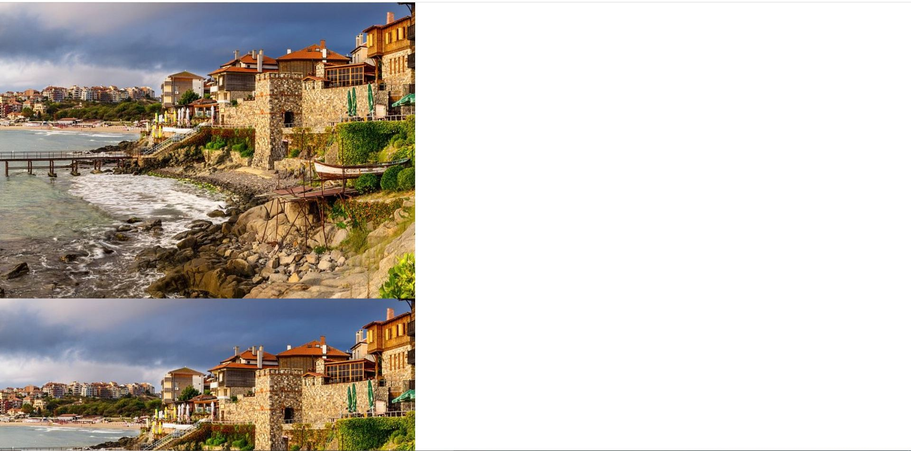

# Background Repeat

## Intro

When a developer uses background-image, by default the provided image would be repeated both horizontally and vertically:

### Default behavior



#### Code Snippet for Default Behavior

```cs
body {
    background-image: url('https://dynamic-media-cdn.tripadvisor.com/media/photo-o/15/34/01/1c/burgas.jpg?w=700&h=500&s=1')
}
```


### Horizontal Repetition



#### Code Snippet for Horizontal Repetition

```cs
body {
    background-image: url('https://dynamic-media-cdn.tripadvisor.com/media/photo-o/15/34/01/1c/burgas.jpg?w=700&h=500&s=1')
    background-repeat: repeat-x;
}
```

### Vertical Repetition



#### Code Snippet for Vertical Repetition

```cs
body {
    background-image: url('https://dynamic-media-cdn.tripadvisor.com/media/photo-o/15/34/01/1c/burgas.jpg?w=700&h=500&s=1')
    background-repeat: repeat-y;
}
```
