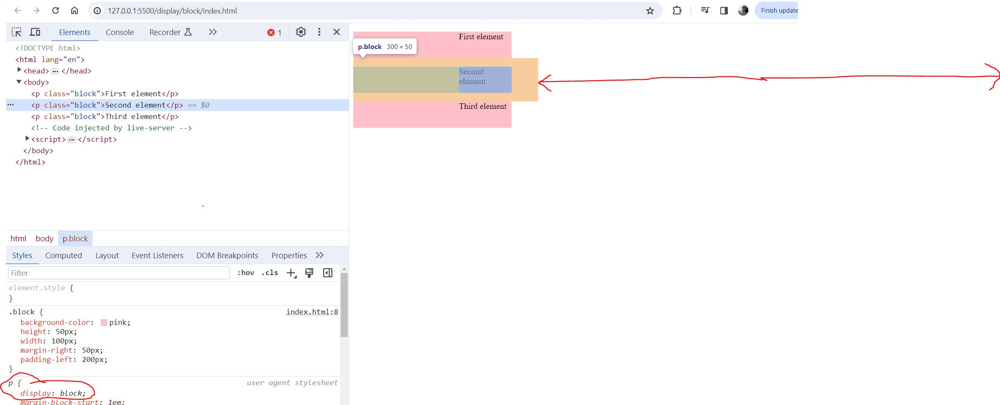

# Display - Block

## Definition

- Displays an element as a block element (like `
`).
- It starts on a new line, and takes up the whole width

- 
- Notice how each block is on a new line despite its width is not that much.
