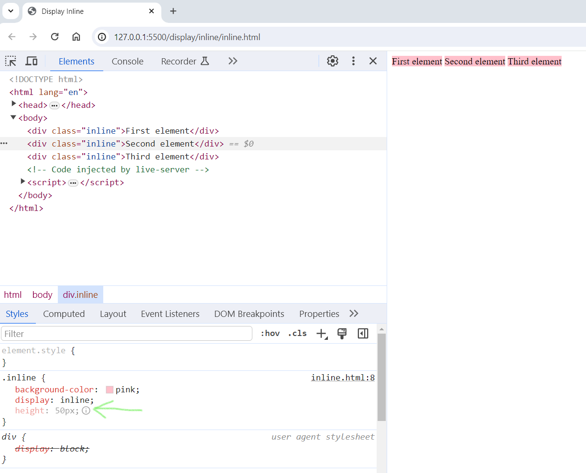

# Display - Inline

## Definition

- Displays an element as an inline element (like ``).
- Any height and width properties will have no effect.

- 

### At the above screenshot you can notice that:

- The height property is ignored.
- div default display property is **blocked**.
- When elements are with `display: inline`, their width is up to the element's content.
- **Please**, check the purple background color how it highlights the element when its `display` property is set to `inline`.
